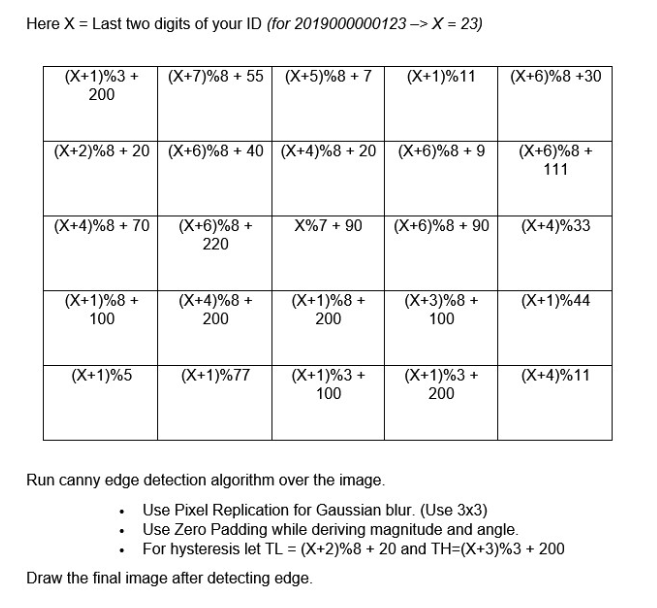

## Modulus Calculator
This is a project to solve real life problem. This is a multi-purpose calculator build in JavaScript. I had a course named (Image Processing) here teacher make different questions for everyone due to having online classes and exams. Here We have to find the modulus of lots of expression. Actually I made this for find modulus of all expression together and easy.
Here is the sample fo question below:

## Features:
- user can find modulus of multiple expression together.
- Not only modulus it can perform any  multiple mathematical operations / expressions.
- Select user preferred row * column
- Here X is a constant value.

## Technologies that are used to build this project:
- HTML5
- CSS3
- JavaScript
- JavaScript DOM

`Live link`: https://uttamsaha.github.io/modulus-calculator/